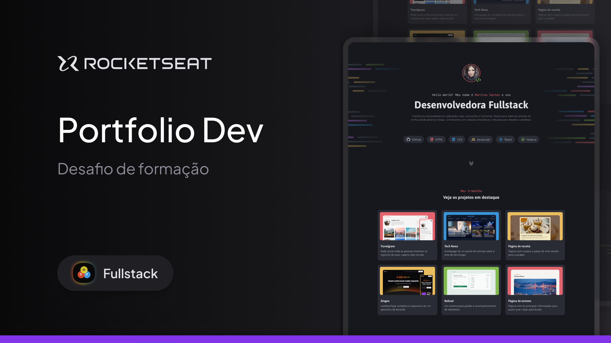

<h1 align="center"> Portfólio Dev - Desafio Prático</h1>

Um site desktop de portfólio para desenvolvedores, com links para projetos e contato do profissional. 
 
Esse é um dos desafios práticos da formação Fullstack, um dos conteúdos disponíveis para alunos da Rocketseat. 

  <a href="#-tecnologias">Tecnologias</a>&nbsp;&nbsp;&nbsp;|&nbsp;&nbsp;&nbsp;
  <a href="#-projeto">Projeto</a>&nbsp;&nbsp;&nbsp;|&nbsp;&nbsp;&nbsp;
  <a href="#-layout">Layout</a>&nbsp;&nbsp;&nbsp;|&nbsp;&nbsp;&nbsp;
  <a href="#memo-licença">Licença</a>

  

 

  

## 🚀 Tecnologias

Esse projeto foi desenvolvido com as seguintes tecnologias:

- HTML e CSS
- Git e Github
- Figma

## 💻 Projeto

Um site desktop de portfólio para desenvolvedores, com links para projetos e contato do profissional. Neste desafio, explorei muito o CSS Grid, conteúdo que estudamos no módulo anterior, e, neste projeto, construí uma base sólida sobre esse conteúdo tão importante no mundo do desenvolvimento. Que desafio legal de desenvolver! Estou pronto para os próximos desafios. 

## 📦 Deploy

O projeto está hospedado na <a href="https://vercel.com/" target="_blank">Vercel</a>, que oferece suporte nativo ao Next.js e facilita o processo de deploy contínuo.

🔗 **Acesse o projeto online:** [Projeto Portfólio](https://projeto-portfolio-alpha-flame.vercel.app/)

## 🔖 Layout

Você pode visualizar o layout completo do projeto por meio deste [link](https://www.figma.com/design/M5eZIo9sq3zhXWlHtjnZEA/Portfolio-Dev--Community---Copy-?node-id=0-1&p=f&t=CTOoSdRnVsGN7ilm-0). Para acessá-lo, é necessário ter uma conta no [Figma](https://figma.com).

# 🧑🏻‍💻 Autor

Feito com ❤️ por Gelzieny R. Martins 👋🏽 [Entre em contato!](https://www.linkedin.com/in/gelzieny-r-martins-180551106/)

## 📝 Licença

Este projeto esta sobe a licença [MIT](./LICENSE).
